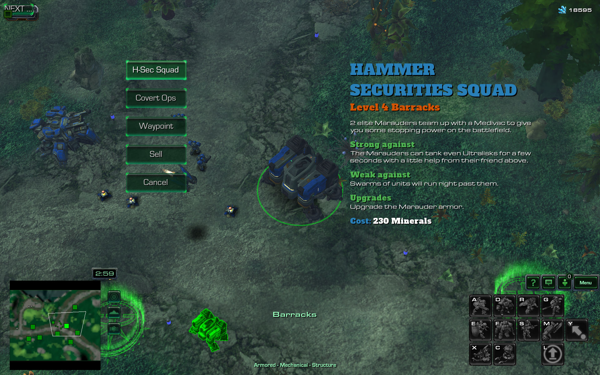
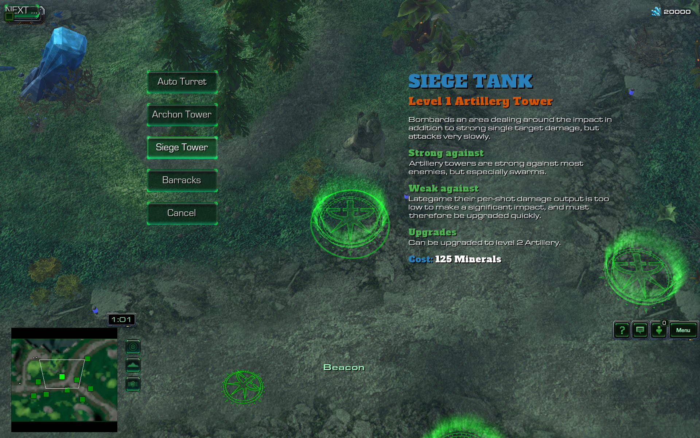
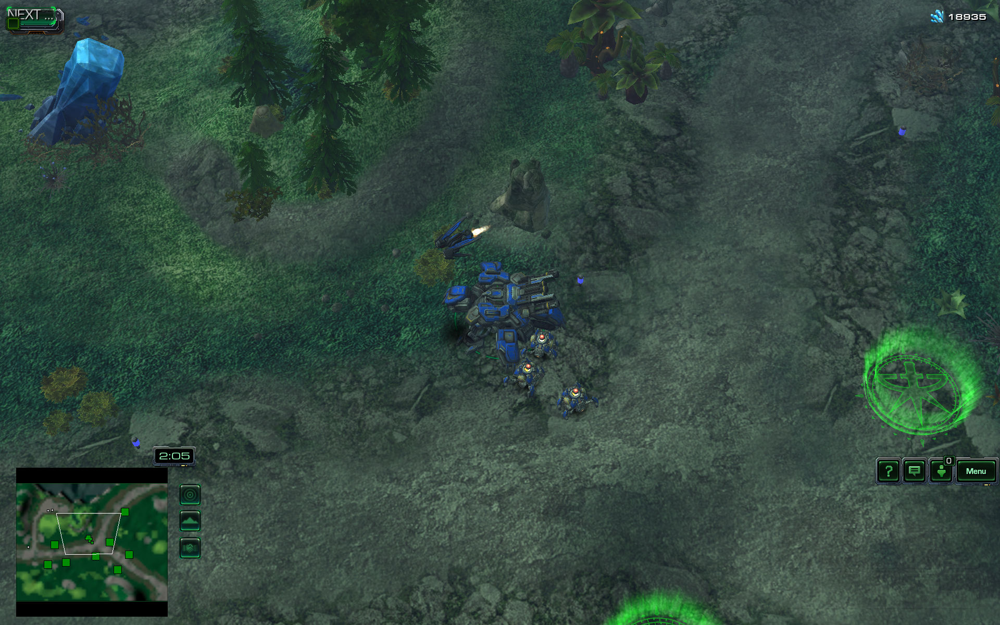
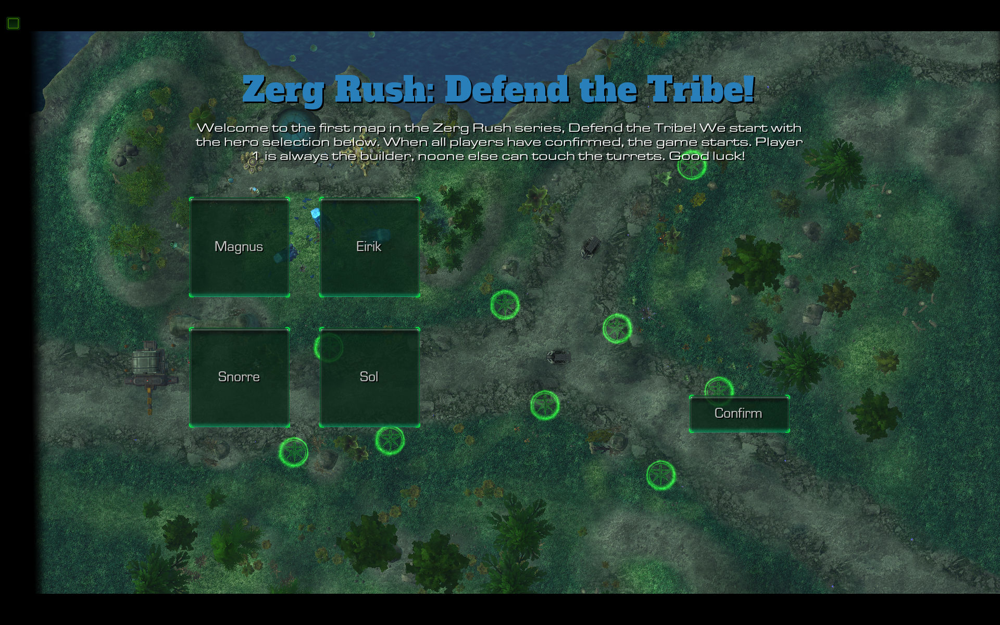

# sc2-zergrush-concept-td
Old Starcraft 2 map concept I made. A tower defense / hero defense type map made mostly in galaxyscript.

All screenshots are taken with the lowest graphics settings possible.

